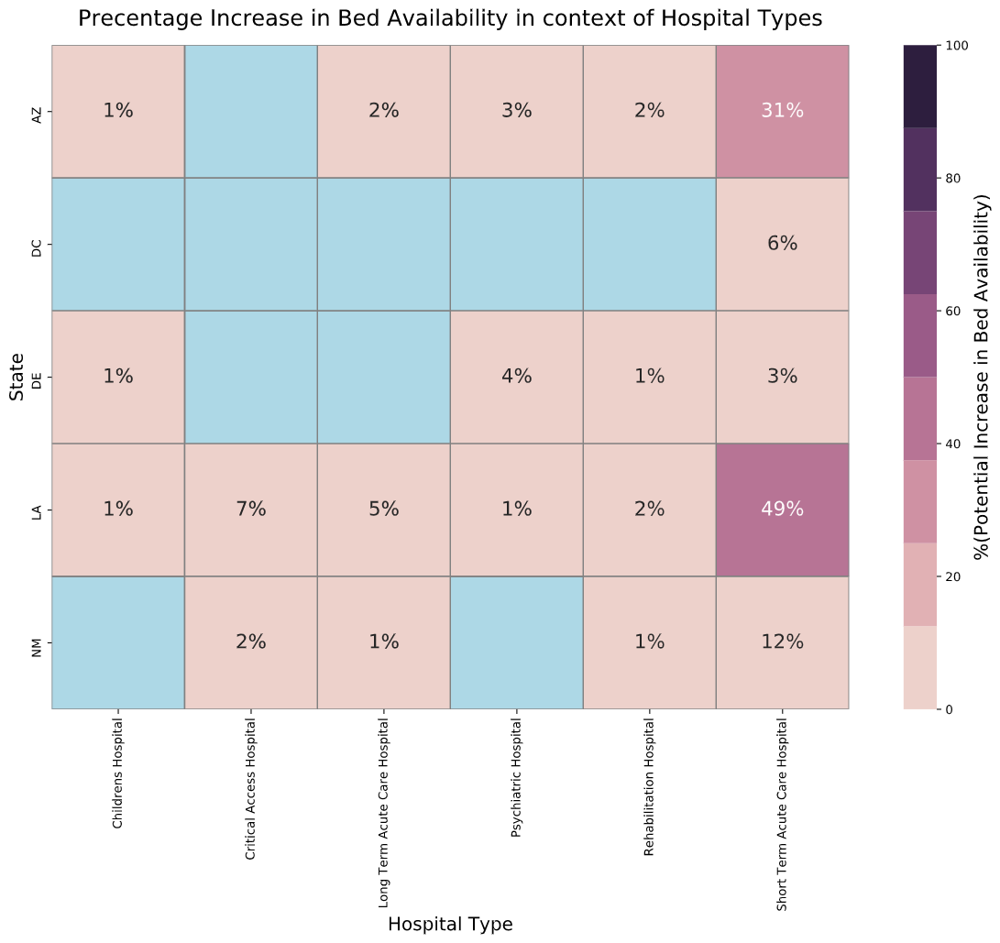

# US Poverty Level impact on Hospital Bed Utilization.

## by Jagadeesh Josyula ##
---
To better understand how socioeconomic status - such as populations living in federal poverty area impacts hospital bed utilization and to help optimize scenario planning for when staff can be shifted around to serve those living in federal poverty areas.

## Investigation Overview ##

In this investigation, I wanted to look at Historical Bed Utilization Rate, Poverty Level, Potential available in Bed capacity, and Hospital type are key features that could help forecast the staffing needs of health workers (doctors, nurses, etc). The staffing needs to a specific hospital type can be scored based on the availability enabling counties in poverty to be better served.

As the next steps, building a machine learning model that helps support and augment health workers where demand exists by integrating with existing staff scheduling system allowing systems to view the model recommendations, allowing healthcare stakeholders to deliver better patient care and improving productivity.

## Dataset

This project explores a dataset containing Hospital Bed data for approximately 6621 hospitals across all counties in the United States. To better understand how the US Poverty Level impacts Hospital Bed Utilization, the poverty level data is sourced from USDA public data that provides the poverty level at the county level.

- [Hospital Bed Data](https://opendata.arcgis.com/datasets/1044bb19da8d4dbfb6a96eb1b4ebf629_0.csv)

- [US Poverty Level Data](https://www.ers.usda.gov/webdocs/DataFiles/48747/PovertyEstimates.xls)

---
# Summary of Findings #

With an increased poverty level, there is an increase in bed availability. The interesting fact that this availability can be made available to hospitals with high bed utilization.

### Population Findings ###

**Hospital Beds Utilization:**  
People living in counties near the poverty level between **10 to 18%** are shown to have high bed utilization.

**Hospital Beds Availability:**  
Short term Acute Care hospitals are shown to have a major percentage of increased bed availability.

A positive relationship we found between an increase in bed capacity and poverty level in the context of bed utilization.

### Cluster Analysis - Top 5 US STATES in Poverty ###

- Short term acute care hospitals are shown to have high bed availability across all 5 states. Louisiana and Arizona states have ** 49% ** and **31%** of bed availability respectively. 
- **District of Columbia** has shown to be trailing in bed availability across all hospital types. A callout on this state being the top poverty state.
- Overall **Louisiana state** is shown to have high bed availability across all hospital types.
- **Arizona state** being the second-highest poverty state stands second in high bed availability across all hospital types.

---
# Conclusion: Findings and Next Steps #

To better understand how socioeconomic status - such as populations living in federal poverty area impact hospital bed utilization and to help optimize scenario planning for when staff can be shifted around to serve those living in federal poverty areas.

Historical Bed Utilization Rate, Poverty Level, Potential available in Bed capacity are key features that can help forecast the staffing needs of health workers (doctors, nurses, etc). The staffing needs to a specific hospital type can be scored based on the availability enabling counties in poverty to be better served.

As the next steps, building a machine learning model that helps support and augment health workers where demand exists by integrating with existing staff scheduling system allowing managers to view the model recommendations, allowing healthcare stakeholders to deliver better patient care and improving productivity.